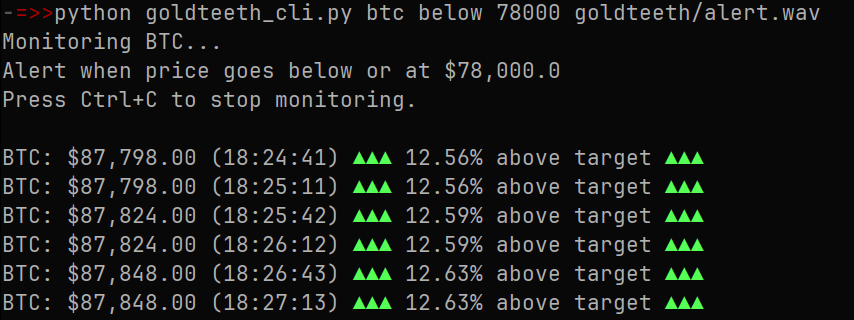
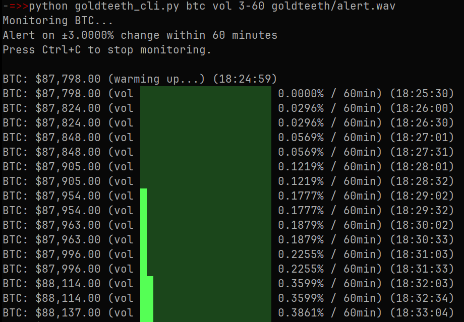
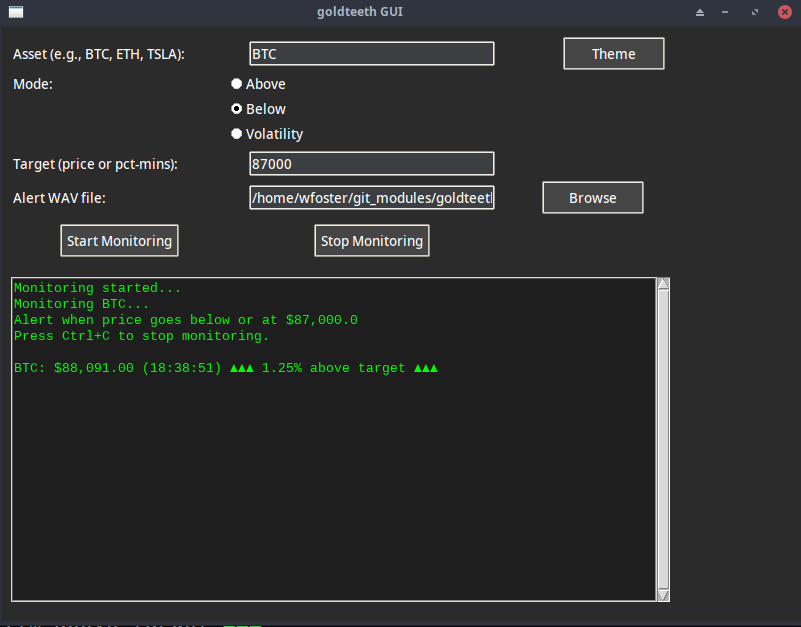

# Goldteeth

[](https://github.com/sadsfae/goldteeth/actions/workflows/flake8.yml)
[](https://pypi.org/project/goldteeth/)

Monitors crypto/stock prices & volatility and plays an alert sound when a
target is reached.

- It will also send a desktop notification on Linux or MAC OSX.
- Run via `python` in a terminal or use the optional GUI.

> [!NOTE]
> Stock prices utilize [Finnhub](https://finnhub.io/register) free API
> (email sign-up required)
>
> Crypto prices utilize the CoinGecko open API but may be rate limited
> occasionally.
>
> (optional) If you want to use free/demo CoinGecko API key use
>
> `export COINGECKO_API_KEY="your_API_key"`

> [!IMPORTANT]
> If you are using a pro/paid CoinGecko API key use
>
> `export COINGECKO_PRO_API_KEY="your_PRO_API_key"`
>
> free/demo and paid API keys use different urls, so goldteeth will choose whichever is better from what you have defined.

## Usage

```bash
python src/goldteeth_cli.py <symbol> <mode> <target> <wav>
```

### Price Targets

```bash
python src/goldteeth_cli.py btc above 100000 src/goldteeth/alert.wav
python src/goldteeth_cli.py eth below 3000 src/goldteeth/alert.wav
```

### Volatility

```bash
python src/goldteeth_cli.py sol vol 10-5 src/goldteeth/alert.wav  # 10% move in 5 mins
python src/goldteeth_cli.py doge vol 5-15 src/goldteeth/alert.wav  # 5% move in 15 mins
python src/goldteeth_cli.py tsla vol 5-10 src/goldteeth/alert.wav  # 5% move in 10 mins
```

### Stocks

- Requires a [Finnhub](https://finnhub.io/register) API key (free, email sign-up)

```bash
export FINNHUB_API_KEY="your_key_here"
python src/goldteeth_cli.py tsla above 400 src/goldteeth/alert.wav
```

#### Limitations
- With the free API key Finnhub still limits you to one websocket connection.
- Goldteeth tries to work around this with recovery loops and HTTP fallback and keep trying if using multiple instances.
- If you see this error it's due to free API limits, if you have a paid API key then you shouldn't see limits.

```
WebSocket error: Connection to remote host was lost.
WebSocket closed
```

## Configuration
- Modify `CRYPTO_INTERVAL` to adjust crypto polling frequency
- Modify `STOCK_INTERVAL` to adjust stock ticker polling frequency

## Requirements

- Python 3 with these libraries:
  - `requests` or `python3-requests`
  - `pytz` or `python3-pytz` (stocks only)
  - `websockets` or `python3-websockets` (stocks only)
- mpv or mplayer (audio alerts)

### GUI

- Right now the GUI is not available via `pip install`

```bash
python src/goldteeth_gui.py
```
## Installation

- There are two ways to Goldteeth:
  - Clone repositry and run (ensure Python libraries are present)
  - `pip install`

### Installation via Pip

```bash
python -m venv goldteeth
. !$/bin/activate
pip install goldteeth
```

#### Usage with Pip

- `alert.wav` is included but you can pass your own audio file.

```bash
goldteeth btc below 88000
```

### Installation via Repository

```bash
git clone https://github.com/sadsfae/goldteeth.git
cd goldteeth
```

#### Run from Repository

```bash
python src/goldteeth_cli.py tsla below 400 src/goldteeth/alert.wav
python src/goldteeth_cli.py btc vol 5-60 src/goldteeth/alert.wav
```

### GUI Installation via Repository

- First make sure you have the repository cloned.
- Be inside the repository directory.

#### Generate GUI Desktop Shortcut

```bash
cat > goldteeth.desktop <<EOF
[Desktop Entry]
Version=1.0
Name=Goldteeth
Comment=Monitor crypto and stock prices
Exec=$(which python3) $(pwd)/src/goldteeth_gui.py
Path=$(pwd)/
Icon=utilities-system-monitor
Terminal=false
Type=Application
Categories=Utility;Finance;
EOF
```

#### Copy GUI Desktop Shortcut

```bash
mkdir -p ~/.local/share/applications/
mv goldteeth.desktop ~/.local/share/applications/
chmod +x ~/.local/share/applications/goldteeth.desktop
update-desktop-database ~/.local/share/applications/
```

- Goldteeth should now appear in your Applications menu in your favorite Desktop Environment.

## Screenshots

### CLI





### GUI


